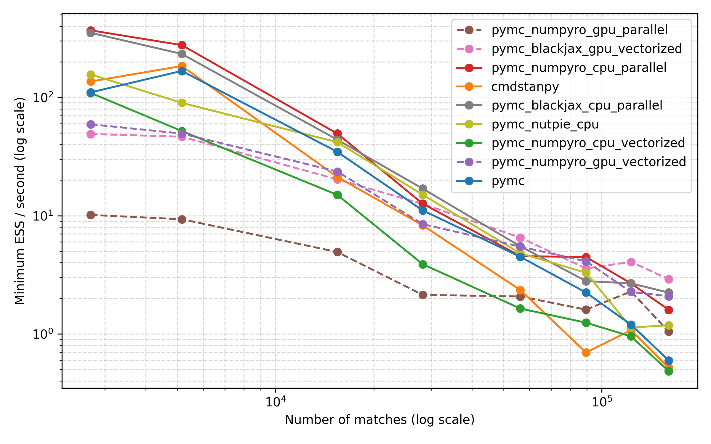
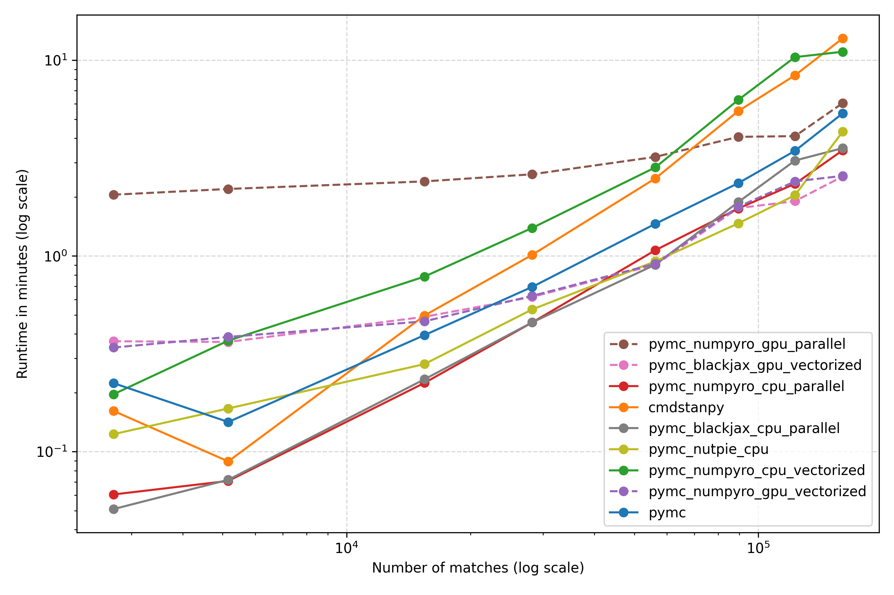
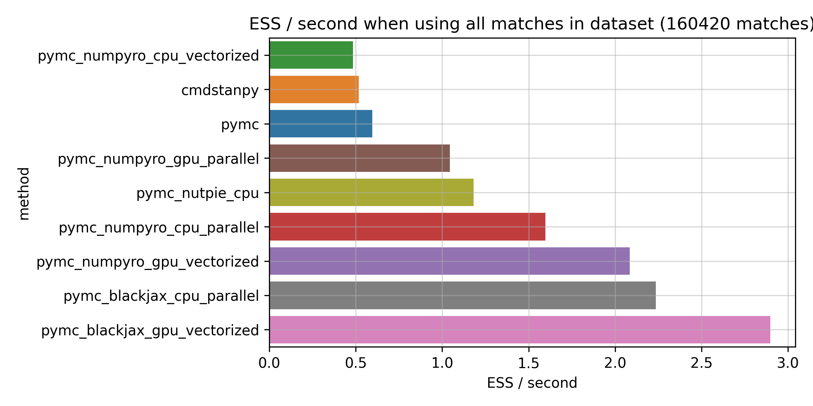
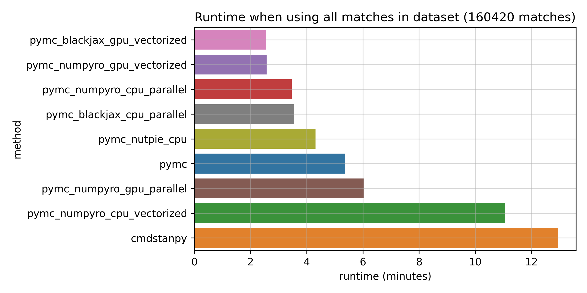

# MCMC benchmarks


---


This code compares Stan, PyMC, , PyMC + JAX numpyro, PyMC + JAX BlackJAX and PyMC + nutpie sampler on a model for
tennis. The first comparisons are posted in the blog post available
[here](https://martiningram.github.io/mcmc-comparison/). The comparisons done here are on a machine with AMD Ryzen 9 7950X3D 16-core processor and with a NVIDIA GeForce RTX 3070 GPU card.

---

### Setup notes

This benchmark uses Jeff Sackmann's tennis data. You can obtain it as follows:

```
git clone https://github.com/JeffSackmann/tennis_atp.git

# If you want to reproduce the results in the blog post, check out this commit:
cd tennis_atp && git checkout 89c20f1ef56f69db1b73b5782671ee85203b068a
```

Requirements that can be installed using pip are listed in
`requirements.txt`. Please install these first.

Once these are done, here are the steps I followed to setup PyMC with JAX support:

* PyMC installed using the instructions here: https://www.pymc.io/projects/docs/en/latest/installation.html#installation
* `blackjax` and `numpyro` were also installed using those instructions.

To run the Stan code, it's best to install `cmdstanpy`.
- Using pip and then `python3 -c "import cmdstanpy; cmdstanpy.install_cmdstan()"`
Instructions for
installing it can be found [here](https://mc-stan.org/cmdstanpy/installation.html).

### How to run

It's easiest to run the benchmarks using the `fit_all.sh` script. Make sure to
first edit the `target_dir` variable in it and amend it to a directory that
makes sense for you. All the model runs will be stored in it under
subdirectories.

Once benchmarks have been run, you can analyse the results and make plots using
the `Compare_runtimes.ipynb` notebook.

If you run into any problems, please raise an issue!

---

### Results


---

---

- **CPU-based sampling:**
  - Performs better for smaller training datasets (between $10^3$ and $2 \times 10^4$).
  - Vectorized sampling on CPU (see `pymc_numpyro_cpu_vectorized`) results in worse runtimes and lower ESS/second compared to other CPU approaches.
  - Parallel sampling on CPUs improves performance for these dataset sizes.
  - Among CPU samplers, JAX-based `numpyro` and `blackjax` perform best.
  - The Rust-based `nutpie` sampler is also competitive.

- **GPU-based sampling:**
  - Outperforms CPU approaches for larger training datasets but the CPU based parallel approach is still competitve.
  - Vectorized sampling on GPU (see `pymc_numpyro_gpu_vectorized` and `pymc_blackjax_gpu_vectorized`) provides the best performance in this setting.
  - Parallel sampling on GPU (see `pymc_numpyro_gpu_parallel`) performs worse, likely due to having only one GPU available.

**Conclusion:**

Taking into account both runtime and ESS/second, the JAX-based `pymc_blackjax_cpu_parallel` and `pymc_blackjax_gpu_vectorized` configurations offer strong performance for posterior sampling, with the optimal choice depending on the size of the training data. Other configurations such as `pymc_nutpie_cpu`, `pymc_numpyro_cpu_parallel`, and `pymc_numpyro_gpu_vectorized` are also promising and worth exploring.